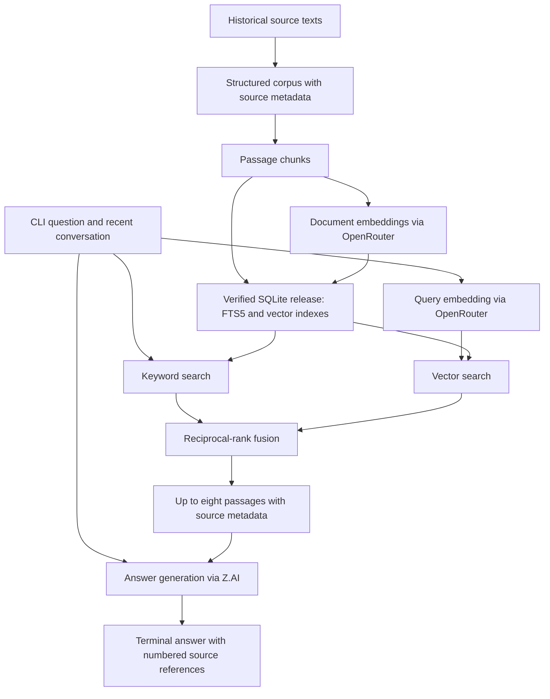

# HomeoRemedica

A Python retrieval-augmented generation (RAG) application for searching historical homoeopathic
literature and generating answers with source citations. It makes **118,259 passages** from
**four books**, covering **1,250 unique remedies**, searchable through a conversational CLI.
The source works are by Allen, Boericke, Clarke, and Kent. Historical reference only; not medical
advice.

The project covers corpus preparation, hybrid search, answer generation, and retrieval evaluation.
Search runs against a local SQLite database; external APIs provide embeddings and generated
answers. The CLI runs directly in Python without an application server.

**Stack:** Python · SQLite FTS5 · sqlite-vec · Pydantic · OpenRouter · Z.AI · pytest · Ruff · Pyright

## Engineering highlights

- **Hybrid retrieval:** combines keyword and vector search through reciprocal-rank fusion, with
  optional filtering by book and up to eight retrieved passages per answer.
- **Structured corpus:** preserves book, remedy, section, and passage metadata across 118,259
  individually embedded passages. See the [dataset guide](dataset/README.md) for source details.
- **Verified corpus releases:** builds immutable SQLite artifacts with manifests and SHA-256
  digests, validates database and index integrity, and verifies releases before activation.
- **Recorded retrieval experiments:** versions query sets and result records, caches embeddings
  and rankings, and compares retrieval strategies through a separate evaluation pipeline.
- **Automated quality checks:** checks package boundaries, builds the Python package, runs linting
  and type checking, and tests against fakes and synthetic artifacts without API keys.

## Architecture

The main `chat` pipeline builds and searches a versioned local corpus:



OpenRouter provides `qwen/qwen3-embedding-8b` embeddings; Z.AI generates answers with
`glm-5.3-flash` by default.

| Design choice | Engineering benefit |
| --- | --- |
| SQLite with FTS5 and sqlite-vec | Keeps source metadata, keyword search, and vector search in one local database. |
| One passage per chunk | Retains the source passage as the retrieval and citation unit. |
| Reciprocal-rank fusion | Combines keyword and semantic rankings without requiring their raw scores to share a scale. |
| Immutable, verified corpus releases | Records the corpus and embedding configuration used by each release and checks integrity before use. |
| Separate `chat` and `eval-chat` retrieval | Supports experiments with ranking and embeddings while sharing conversation and answer-generation code. |

## Retrieval results

The experimental retriever evaluates remedy rankings against labeled symptom queries. In the
recorded v8–v9 experiment, adding a symptom-focused instruction to the embedding query improved
validation **Recall@8 by 5.75 percentage points**.

Across all 500 queries, v9 achieved **94.47% candidate recall at a pool size of 640 remedies**.
Candidate recall measures the fraction of labeled target remedies present in that larger ranked
pool, averaged across queries; Recall@8 measures how many reach the first eight results.

| Metric across all 500 queries | v8 | v9 |
| --- | ---: | ---: |
| Candidate recall @ 640 | 94.67% | 94.47% |
| Recall@8 | 20.77% | 24.57% |

Source: recorded [v8 results](benchmarks/results/v8.json) and
[v9 results](benchmarks/results/v9.json), using 4,096-dimensional embeddings.

Recall@8 by query group:

| Query group | Queries | v8 Recall@8 | v9 Recall@8 |
| --- | ---: | ---: | ---: |
| Development | 239 | 21.76% | 23.43% |
| Validation | 261 | 19.86% | 25.61% |
| All queries | 500 | 20.77% | 24.57% |

Recall@8 measures the fraction of labeled target remedies found in the top eight ranked remedies,
averaged across queries. These results describe the experimental `eval-chat` retrieval strategy,
which uses normalized score fusion and aggregates passage evidence into remedy rankings. Answer
generation and the main `chat` retriever are outside this measurement.

The comparison uses query dataset v3 and a validation subset that shares no exact symptom text
with the development subset. Validation results were inspected during experimentation, so this is
an exploratory comparison. See the [comparison record](benchmarks/results/v9-comparison.json),
[experiment log](benchmarks/results/v9-experiments.json), and
[benchmark guide](benchmarks/README.md) for settings, scores, and query provenance.

## Quick start

Requirements: Python 3.14 (pinned to 3.14.3), uv `>=0.11.23,<0.12`,
and API keys for OpenRouter and Z.AI. Corpus builds require SQLite 3.53.4 and
`sqlite-vec` 0.1.9, as configured in `corpus.toml`.

Run from the repository root:

```sh
uv sync --locked
cp .env.example .env
```

Set `OPENROUTER_API_KEY` and `ZAI_API_KEY` in `.env`, then build the corpus and start chatting:

```sh
uv run --locked corpus validate
uv run --locked corpus build local-v1
uv run --locked chat
```

The CLI verifies the active corpus at startup. Type a question, use `/books` to list the
available books, `/clear` to reset conversation history, or `/quit` to exit. It prints the
answer and numbered source references. To ask one question and exit, run:

```sh
uv run --locked chat What does Kent say about Nux vomica?
uv run --locked chat --book kent-lectures "What does Kent say about Nux vomica?"
uv run --locked chat --list-books
```

Repeat `--book` to search up to four selected books. Conversation history stays in memory for
the current CLI session.

The source dataset is included; generated SQLite releases are not. Building a release calls
OpenRouter to embed the corpus. Use a unique version for each build; existing releases cannot
be overwritten. To use an existing release instead, set `RAG_CORPUS_DIR` to its parent directory
containing `active.json`.

## Configuration

The CLI reads environment variables and optional `.env` and `.env.local` files.

| Variable | Default | Purpose |
| --- | --- | --- |
| `OPENROUTER_API_KEY` | Required | Corpus and query embeddings. |
| `ZAI_API_KEY` | Required for chat | Answer generation. |
| `RAG_CORPUS_DIR` | `artifacts/corpus` | Active pointer and versioned corpus releases. |
| `RAG_MODEL` | `glm-5.3-flash` | Answer model. |
| `RAG_MAX_OUTPUT_TOKENS` | `4096` | Output token limit, from 1 to 4096. |

Each question retrieves up to eight passages from the local corpus and sends the grounded prompt
to Z.AI. OpenRouter supplies query embeddings. No local HTTP server is needed.

## Corpus tooling

`corpus.toml` configures the source data, chunking, embeddings, and release output. The default
pipeline reads `dataset/corpus.json`, treats each passage as one chunk, and builds one shared
SQLite database for all four books.

```sh
# Validate sources and chunking locally; no API key needed.
uv run --locked corpus validate

# Verify and activate an existing release.
uv run --locked corpus activate local-v1
```

Builds write `corpus.sqlite` and `manifest.json` under `artifacts/corpus/<version>/`, then update
`active.json` after verification. Start a new CLI session to load a newly activated release.
Use `build <version> --workers 8` to reduce the default 32 concurrent embedding requests.

## Evaluation

`src/eval_chat/` owns experimental retrieval, benchmark scoring, and a separate chat CLI.
Retrieval settings live in `evaluation.toml`; query datasets and recorded results live in
`benchmarks/`.

Before running, change `output.result` in `evaluation.toml` to an unused versioned path such as
`benchmarks/results/v10.json`. The checked-in configuration points to the existing v9 result,
and results cannot be overwritten.

```sh
uv run --locked evaluation
```

Evaluation requires an OpenRouter key and caches embeddings and rankings in `.cache/benchmarks/`.
See the [benchmark records](benchmarks/README.md) for details.

To chat with the experimental retriever, set both `OPENROUTER_API_KEY` and `ZAI_API_KEY`, then run:

```sh
uv run --locked eval-chat
uv run --locked eval-chat --book kent-lectures "What does Kent say about Nux vomica?"
uv run --locked eval-chat --list-books
```

`eval-chat` has the same interactive commands and answer format as `chat`. It reads the `[chat]`
section of `evaluation.toml` for the selected embedding dimension and answer model, alongside
the corpus and retrieval settings. Its first run prepares document embeddings
and a disk-backed search index under the evaluation cache directory; later runs reuse them.
The current dataset has 118,259 chunks, so first-time preparation uses substantial OpenRouter
requests and several gigabytes of local cache space.
The experimental CLI reads the source dataset and does not require an active corpus release.

## Development

```sh
uv sync --locked --all-groups
make check
```

`make check` runs repository boundary checks, a Python build, Ruff, Pyright, and
pytest. Tests use fakes and synthetic artifacts; they do not require API keys or a built corpus.

- `src/shared/` — conversation contracts, terminal behavior, answer generation, and prompts.
- `src/chat/` — production retrieval from an active corpus release.
- `src/chat/cli.py` — production terminal chat.
- `src/eval_chat/` — experimental retrieval, scoring, and terminal chat.
- `src/corpus/` — source validation, chunking, embeddings, and release tooling.
- `dataset/` — raw texts, processed books, and merged corpus; see the [dataset guide](dataset/README.md).
- `tests/` — Python test suite.

## License

Software and documentation: [MIT](LICENSE). Dataset compilation and processing:
[CC BY 4.0](dataset/LICENSE.md). Underlying historical works retain their applicable rights
and source notices.
